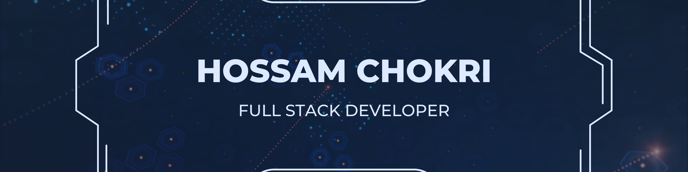

  

### Hi there! 
 
I'm [**Hossam**](https://hossamchokri.com), a passionate full stack developer. 

I like combining my technical knowledge with design to create efficient applications. My goal is to build scalable and efficient applications while providing engaging and flawless user experiences. 

Outside of coding, I enjoy learning new languages, working out, and spending time with family.

### Skills :

### GitHub Stats :

### Let's Connect!

