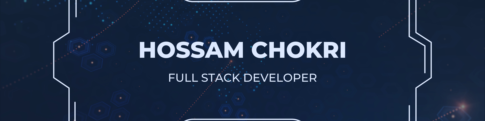

<!-- 

  

 -->

### Hi there! 
 
I'm [**Hossam**](https://hossamchokri.com), a passionate full stack developer. 

I am passionate about using my technical expertise and problem-solving skills to build scalable, efficient applications. I focus on bridging back-end functionality with front-end usability to deliver seamless, engaging user experiences. I thrive on solving complex challenges, optimizing performance, and creating intuitive, user-centric designs. My goal is to craft robust solutions that meet modern development standards 

Outside of coding, I enjoy learning new languages, working out, and spending time with family.

### Skills :

## 🚀 Skills

### 🔹 Languages
  
  
  
  
  
  

---

### 🔹 Frameworks & Libraries
  
  
  
  
  
  
  

---

### 🔹 Databases
  
  
  
  

---

### 🔹 Tools & Others
  
  

### GitHub Stats :

### Let's Connect!

